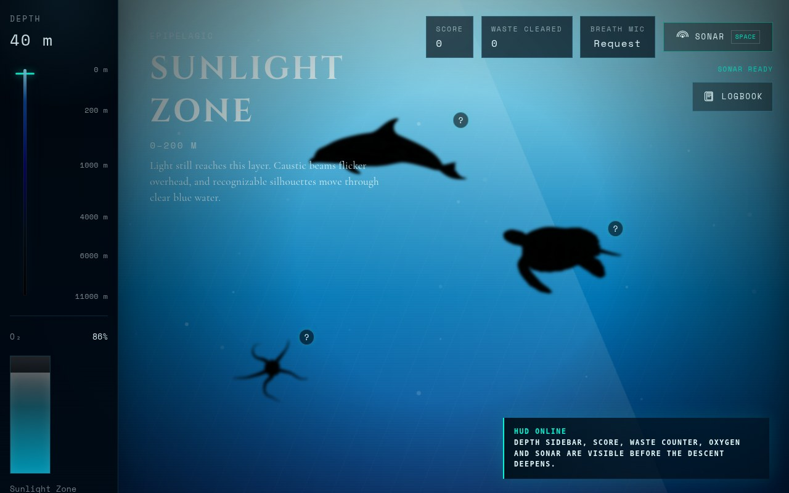
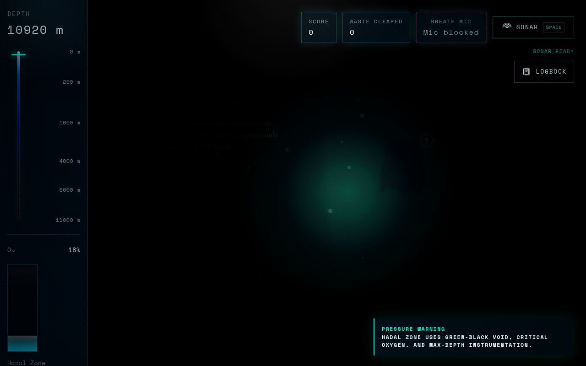
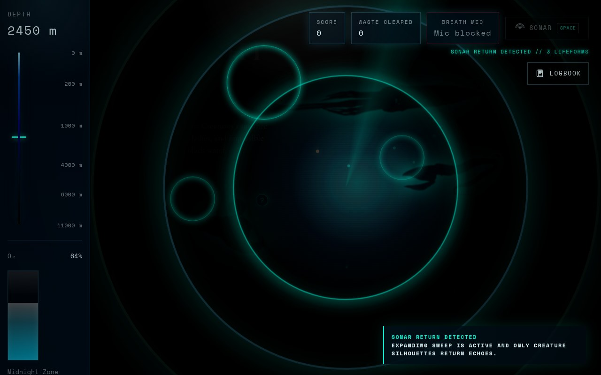
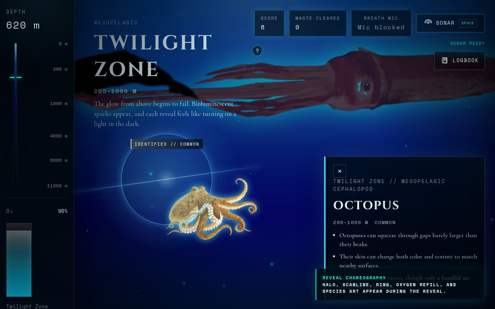
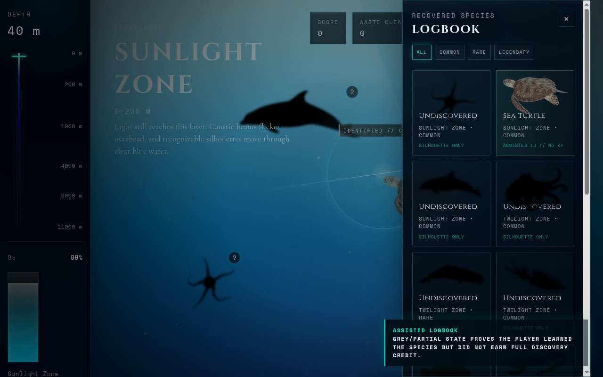
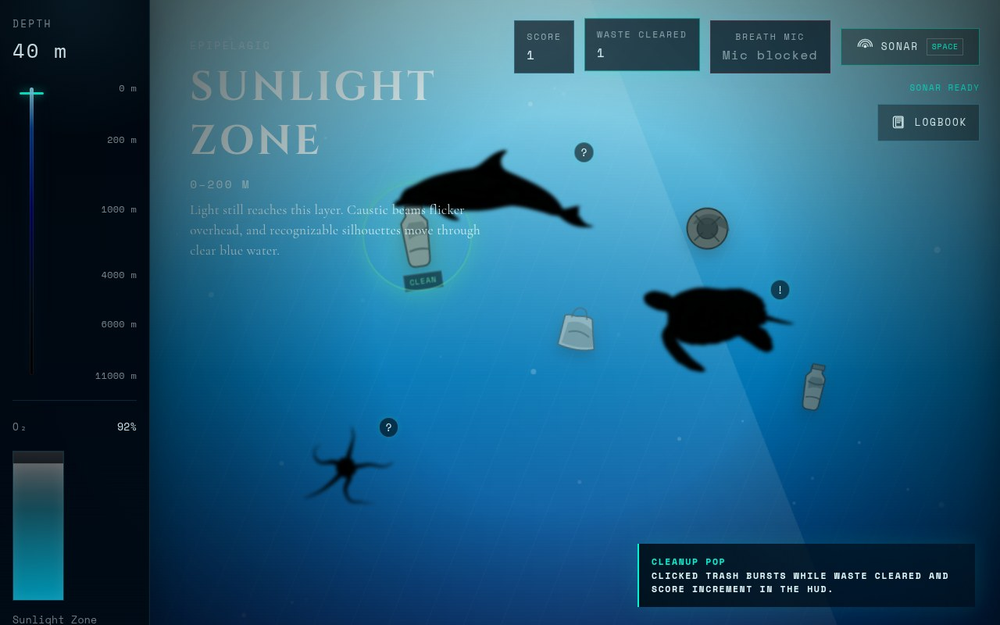
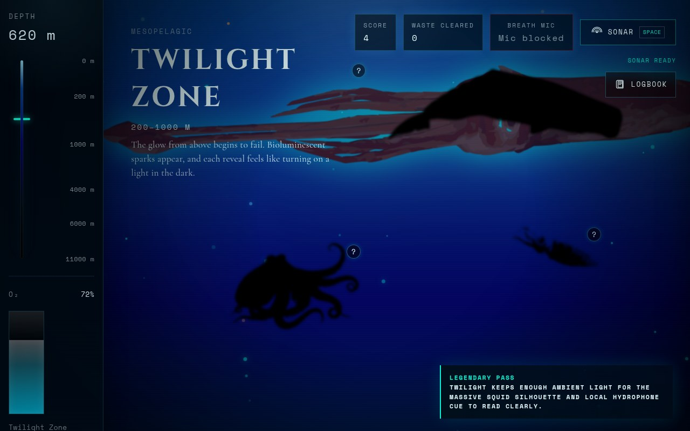
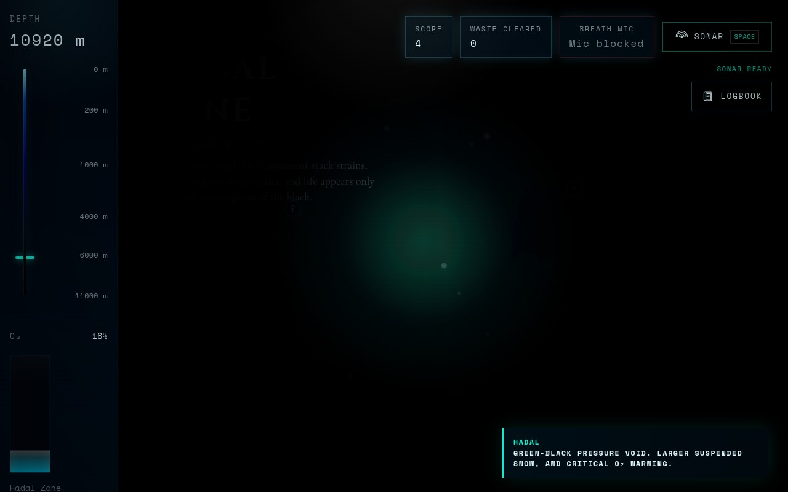
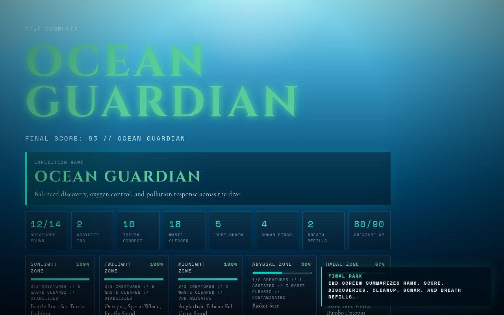

# DeepDive

DeepDive is a static, scroll-driven ocean depth explorer built for a hackathon. It takes the player from the surface to the hadal zone with cinematic transitions, silhouette creature reveals, trivia-based discovery, pollution cleanup, an oxygen system, a logbook, and an end-of-run rank screen.

## Feature screenshots

The full proof pack is in [`docs/feature-screenshots`](docs/feature-screenshots). Each feature has its own folder with multiple browser screenshots so judges can verify mechanics without relying only on the 2-minute walkthrough.

| Feature | Screenshot proof |
| --- | --- |
| Intro, HUD, depth navigation |  |
| Hadal pressure atmosphere |  |
| Lifeform-only sonar returns |  |
| Trivia reveal choreography |  |
| Second chance and assisted logbook state |  |
| Pollution cleanup counter and feedback |  |
| Twilight giant squid pass and Midnight flashlight |  |
| Abyssal vs Hadal atmosphere |  |
| Final rank and zone breakdown |  |

## Run locally

From the project root:

```bash
python3 -m http.server 4173
```

Then open:

```text
http://127.0.0.1:4173/
```

## What is done

- Single-page HTML/CSS/JS build with no framework or bundler
- Five ocean zones with custom atmosphere and depth-driven visual progression
- JS-controlled zone transitions with animated depth instrumentation
- Creature silhouette discovery flow with trivia and reveal choreography
- Sonar ping mechanic on the Space key and HUD button, with expanding sweep, target echo rings, and return readouts for hidden creatures and waste
- Breath-to-refill O2 using Web Audio microphone detection, with bubble feedback when breath is detected
- Automatic flashlight cursor in Midnight, Abyssal, and Hadal zones
- Progressive mobile tilt support for spotlight movement and zone navigation
- Giant squid background pass in the Twilight Zone with a local NOAA hydrophone cue; the actual Giant Squid discovery remains in Midnight
- Pollution collection loop with a small static set of readable illustrated pollutants, visible cleanup feedback, and zone mood response
- Wrong-answer learning flow with correct-answer feedback, second attempt, and assisted logbook state
- Logbook, creature detail panel, assisted IDs, and rarity filters
- Tuned O2 economy with faster drain under deeper pressure and smaller assisted refill values
- Normalized 100-point scoring across discovery, cleanup, streak, accuracy, and zone completion
- Results screen with final rank, score stats, sonar usage, and zone-by-zone breakdown
- Local art assets flattened into `assets/`
- Minimal inline SVG pollution set: bottle, plastic bag, tire, drum, and microplastic cluster
- Local audio assets in `assets/audio/`; active ambience is generated with Web Audio, and the squid easter egg uses a local NOAA cue so the demo is offline-safe and does not stream sound files at runtime

## Quick checklist

- [ ] Start the dive from the intro screen
- [ ] Move through all five zones with wheel or arrow keys
- [ ] Press Space or click Sonar and confirm a cyan pulse plus `SONAR RETURN` HUD message
- [ ] Confirm sonar echo rings pulse back from hidden creatures only, not pollution objects
- [ ] Allow microphone access and blow into the mic to confirm O2 refill bubbles
- [ ] Enter Midnight Zone and confirm the cursor flashlight turns on automatically
- [ ] Reveal at least one creature
- [ ] Answer one creature incorrectly and confirm the correct answer is shown, the creature stays retryable, and the logbook marks it as a signal/assisted state
- [ ] Collect at least one pollution item
- [ ] Ignore at least five pollution items in one zone and confirm the red polluted vignette appears
- [ ] Collect at least five pollution items in one zone and confirm the zone brightens/cleanses
- [ ] Open the logbook and test Common/Rare/Legendary filters
- [ ] Confirm O2 drains and refills
- [ ] Confirm O2 drains faster in deeper zones than at the surface
- [ ] Confirm Abyssal has 2 discoverable creatures: Basket Star and Sea Pig
- [ ] Confirm Abyssal and Hadal look distinct, with Hadal showing green-black pressure atmosphere and slower larger marine snow
- [ ] Enter Twilight and confirm the giant squid pass is visible above the background atmosphere; later, confirm Giant Squid discovery still happens in Midnight
- [ ] Confirm underwater ambience starts after user interaction if browser audio is allowed; it should feel muffled/low-pass, not click-heavy
- [ ] Confirm the end screen appears when O2 reaches 0 and shows all five zone result rows
- [ ] Check Chrome DevTools Console for zero errors
- [ ] Check Network for zero 404s

## Audio notes and credits

The active in-app soundscape is procedural Web Audio: low-passed current noise, low rumble, soft bubbles near the surface, and slower pressure/creature tones deeper down. The Twilight squid pass also plays a local hydrophone-style cue. This avoids demo-time network dependency and avoids sharp click-heavy samples.

Breath mic requires `localhost` or HTTPS. If the HUD shows `Tap retry` or `Mic blocked`, click the Breath Mic chip after allowing microphone permission.

- `assets/audio/sperm_whale_clicks.ogg`: "Sperm Whale Ordinary Clicks" from Wikimedia Commons, CC0.
- `assets/audio/noaa_bloop.wav`, `assets/audio/noaa_calving.wav`, `assets/audio/noaa_tremor.wav`, `assets/audio/noaa_julia.wav`: NOAA PMEL Acoustics public sound examples.
