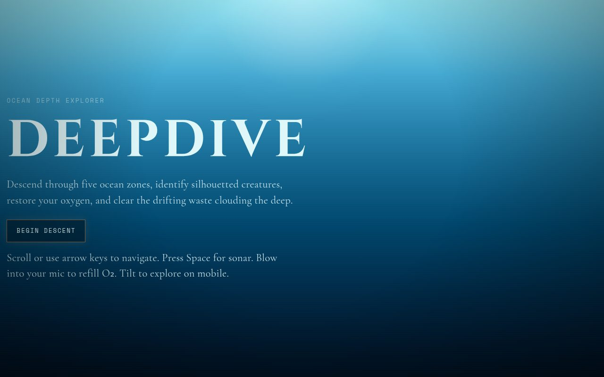
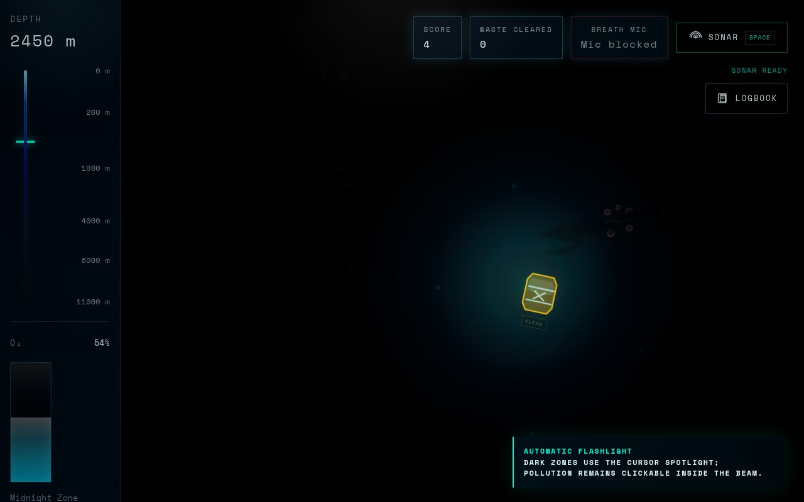

# DeepDive

**Web Dev Code-a-Site Hackathon Winner 2026.**

An ocean depth explorer built with plain HTML, CSS, and JavaScript. No framework, no build step, no install.

You descend from the Sunlight Zone into the Hadal trench, identify silhouetted creatures, manage oxygen, clean pollution, ping sonar in the dark, and surface with a final expedition rank.

## Screenshots

<p>
  
  
</p>

<p>
  
  
</p>

<p>
  
  
</p>

## Run

```bash
python3 -m http.server 4173
```

Open:

```text
http://127.0.0.1:4173/
```

## Built With

- HTML
- CSS
- JavaScript
- Web Audio API
- Google Fonts

## Credits

- Creature illustrations are local assets sourced from the Neal.fun deep-sea asset pack.
- `assets/audio/noaa_bloop.wav` is from NOAA PMEL Acoustics public sound examples.
